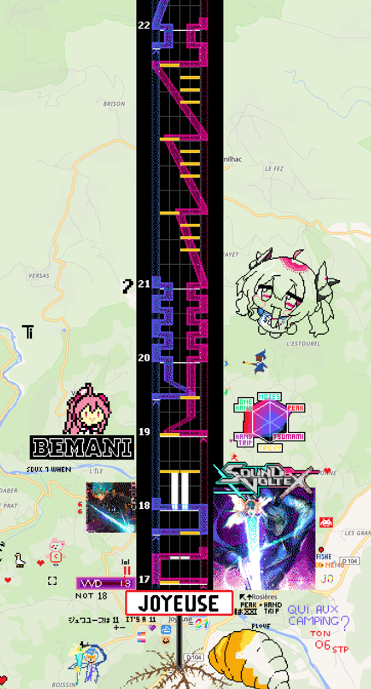
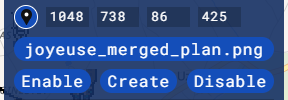
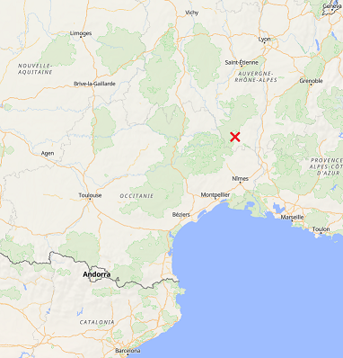

# Joyeuse 그리기 프로젝트

> [!NOTE]
> [The English guide is available at here.](./README.md)

이 프로젝트는 프랑스의 코뮌 Joyeuse의 북쪽에 악명 높은 사볼 채보 **Joyeuse VVD**를 그리는, [Sound Voltex](https://wplace.live/join?id=01989f5c-68ff-7a63-8f28-d965e94dbab1) alliance에서 진행 중인 wplace 프로젝트입니다.

<https://wplace.live/?lat=44.48427938791829&lng=4.241337559277344&zoom=12.923648022597831>

## 템플릿 이미지

[joyeuse_merged_plan.png](./joyeuse_merged_plan.png) 파일을 템플릿 이미지로 사용 해 주세요.

이 문서의 뒷부분에 설명되어 있는 대로 BlueMarble을 설치하고 이용하면 더 편리하게 템플릿을 이용할 수 있습니다.

BlueMarble용 좌표는 다음과 같습니다: **1048 738 86 425**.

### 대축척지도

[이 폴더](./doc/zoom-in/)에는 현재 작업 중인 구간을 확대해 본 이미지들이 있습니다.
BlueMarble을 사용할 수 없다면, 저 이미지들을 레퍼런스로 삼아 주세요.

**꼭 저 부분에서만 작업하라는 뜻은 아닙니다.** 다른 부분을 자유롭게 작업해도 됩니다.

## BlueMarble 설정하기

[BlueMarble](https://github.com/SwingTheVine/Wplace-BlueMarble)은 wplace 위에 템플릿 이미지를 보여주는 유저스크립트입니다.

설치 방법은 다음과 같습니다. BlueMarble에서 제공하는 설치 방법과 거의 동일하지만, 설치 할 스크립트의 경로가 다릅니다.

1. TamperMonkey를 설치합니다.
    - 구글 크롬: [이 확장 기능](https://chromewebstore.google.com/detail/tampermonkey/dhdgffkkebhmkfjojejmpbldmpobfkfo)을 설치합니다.
      - 확장 기능을 설치한 뒤, 확장 기능 아이콘 우클릭 -> "확장 프로그램 관리" -> 우측 위 "개발자 모드" 활성화 -> 옵션 중 "사용자 스크립트 허용" 활성화
    - 파이어폭스: [이 플러그인](https://addons.mozilla.org/en-US/firefox/addon/tampermonkey/)을 설치합니다.
2. BlueMarble의 [Releases](https://github.com/SwingTheVine/Wplace-BlueMarble/releases) 페이지로 이동합니다.
3. 제일 위에 있는 릴리즈의 제목을 클릭합니다.
4. 아래로 스크롤 해, "Assets"에서 `BlueMarble.user.js`를 클릭합니다.
5. Tampermonkey가 제대로 설치되어 있다면 설치 페이지가 표시됩니다. 스크립트를 설치 해 주세요.

모바일에서는 파이어폭스를 사용하면 유저스크립트를 사용할 수 있습니다.

앞서 언급한 템플릿 이미지와 좌표를 BlueMarble를 다음과 같이 설정한 다음 "Create" 버튼을 누르면 템플릿이 지도 위에 표시됩니다.

## 그리기 가이드

이미지를 그릴 때에는 **기본 제공되는 31가지 색상**만 사용 해 주세요.

그리는 순서는 자유지만, 더 효과적으로 그리기 위한 팁은 다음과 같습니다. (필수 아님)

- 채보의 아래쪽 부분부터 그립니다.
- 레이저의 윤곽선과 노트부터 그립니다.
- 선을 새로 그릴 때는 듬성듬성 점을 찍어 그립니다.
- 면을 채울 때는 점을 흩뿌리듯이 채워 넣습니다.

BlueMarble을 쓸 수 없다면, 간단한 부분부터 채워 넣어 주세요.

- 이미지의 가장자리와 여백 (검은색)
- 마디 번호의 검은색 테두리
- BT 노트는 *light gray* 색 테두리에 속은 하얀색입니다.
- FX 노트는 *yellow* 색 테두리에 속은 *gold* 색 입니다.

현재 맨 아래 두 줄은 다른 그림이 차지하고 있습니다. **맨 아래 두 줄은 그대로 놔둬 주세요.**

## TMI

Joyeuse는 마르세유의 북서쪽, 리옹의 남남서쪽에 위치한 [코뮌](https://namu.wiki/w/%EC%BD%94%EB%AE%8C)입니다.
위치를 직접 찾으려면 아래 지도를 활용하세요.

