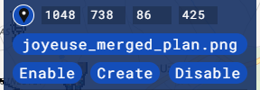
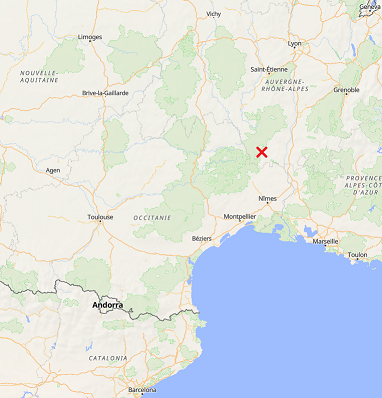

# Let's Draw Joyeuse

> [!NOTE]
> Si notre projet a perturbé votre dessin, [ce document](./CONFLICT.md) peut aider à résoudre le conflit.

> [!IMPORTANT]
> Before you start, please read [our policies](./POLICY.md).

> [!NOTE]
> [한국어 가이드를 보려면 이 링크를 클릭 해 주세요.](./README.ko.md)

This is an ongoing wplace project by [Sound Voltex](https://wplace.live/join?id=01989f5c-68ff-7a63-8f28-d965e94dbab1) alliance to draw a part of [Joyeuse VVD](https://youtu.be/g8KqV90aeg8?t=26s), an infamous chart from the rhythm game Sound Voltex, above *Joyeuse, France*.

<https://wplace.live/?lat=44.48427938791829&lng=4.241337559277344&zoom=12.923648022597831>

> [!WARNING]
> The signage right below the chart is **not** part of the project.
> It's a typical commune name sign, drawn by French people.
>
> To help fighting griefers, we do provide a [template for the sign](./partial/sign.png).

## Recent Changes

List is written in reverse order; the most recent change is at the top.

- 2025-08-16: Shifted Rasis 4 pixels to right, and added some more minor modifications.
- 2025-08-16: Added the pixel art of Rasis next to *le rasis*. **Further changes may happen to the area near her.**
- 2025-08-16: **Removed the *la crotte* hole**. Reason: it keeps getting filled, and no concensus was made towards keeping the hole.
- 2025-08-15: ~~Added "torned hole" effect near *la crotte*. The intention is to leave a gap for others to draw in the hole.~~
- 2025-08-15: Fixed measure no. "22", and removed regions near *la crotte* and *le rasis* for the time being.

## Template

Use [joyeuse_merged_plan.png](./joyeuse_merged_plan.png) as the template image.

For convenience, try installing and using BlueMarble as described in a later section of this document.

The coordinates for BlueMarble are: **1048 738 86 425**.

### Zoomed-In Views

[This folder](./doc/zoom-in/) contains several zoomed-in views of the sections we're working on.
If you can't use BlueMarble, use these those as references.

Working on those parts are **not mandatory**. You may freely work on other parts of the chart.

## Using BlueMarble

[BlueMarble](https://github.com/SwingTheVine/Wplace-BlueMarble) is a [userscript](https://en.wikipedia.org/wiki/Userscript) for overlaying template images on wplace.

Follow the installation guide written on there, but for one-click-installing the script, **do this instead**:

1. Go to the [Releases](https://github.com/SwingTheVine/Wplace-BlueMarble/releases) page.
2. Click the title of the latest release.
3. Scroll down. Under "Assets", click `BlueMarble.user.js`.
4. If Tampermonkey has been installed correctly, then you should be greeted with the installation page.

On mobile, you may use Firefox to use userscripts.

Use the template image and coordinates as described before to configure BlueMarble, like this, and then click "Create" to show the template image on the map.

## Drawing

You should only use one of 31 default colors to draw the image.

You may draw any part of the image, but for maximal effectiveness, here are non-mandatory guidelines.

- Draw lower (southern) parts of the chart first.
- Draw notes and outlines of lasers first.
- When drawing new lines, draw them as sparsely dotted lines first.
- When filling in areas, spray the dots.

If you can't use BlueMarble, then here are some easy targets to draw:

- Border and black margin of the image, which is *black*.
- Black outlines of the measure numbers.
- BT notes with *light gray* border and *white* fill.
- FX notes with *yellow* border and *gold* fill.

## Extra

I sometimes hold [votes](./VOTE.md) on what to do.

Joyeuse, France is a commune located northwest of Marseille, and south-southwest of Lyon.
Use the following map to locate Joyeuse, France manually.

